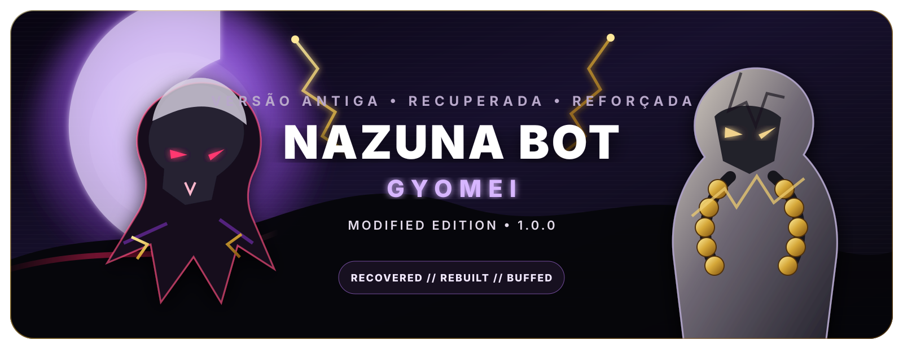

<p align="center">
  
</p>

<h1 align="center">NAZUNA BOT • GYOMEI</h1>

<p align="center">
  <strong>Uma base antiga recuperada, corrigida e reforçada.</strong><br>
  Nazuna 9.0 com novos comandos, automações, personalidade GYOMEI e deploy controlado.
</p>

<p align="center">
  <a href="https://chat.whatsapp.com/Ju0zjLiBLe28eNGUu2gapY"><strong>ENTRAR NO GRUPO DO WHATSAPP</strong></a>
  ·
  <a href="https://github.com/dgreych/nazuna9.0-com-automa-es"><strong>REPOSITÓRIO DA VERSÃO MODIFICADA</strong></a>
</p>

---

## Sobre esta versão

A **NAZUNA BOT - versão modificada GYOMEI** preserva a base Nazuna 9.0 e acrescenta correções, comandos e automações sem fingir que o projeto nasceu ontem, hábito bastante popular em repositórios derivados.

**GYOMEI** identifica esta edição modificada e a personalidade principal da IA. O projeto-base continua sendo a **Nazuna Bot**.

Versão modificada atual: `1.0.0`.

## Principais melhorias

- personalidade GYOMEI com identidade e comportamento protegidos;
- IA acionada por menção ou resposta direta ao bot;
- prompts adicionais configuráveis pelos donos;
- donos adicionais com privilégios administrativos;
- transcrição manual e automática de áudio;
- recuperação das cinco mensagens apagadas mais recentes;
- mídias personalizadas para menus e respostas;
- cartão curto e legível para comandos digitados incorretamente;
- validação local, pública e de deploy;
- artefato de servidor **root-ready**, sem pasta externa quebrando o startup;
- build pública higienizada e build privada com estados locais controlados.

## Créditos e origem

Este repositório mantém as responsabilidades separadas e não remove os créditos originais.

### Criação original da Nazuna

**Hiudy (Hiduy)**

- WhatsApp: https://wa.me/553391967445
- GitHub: https://github.com/hiudyy
- Instagram: https://instagram.com/hiudyyy_

### Continuidade da Nazuna

**DevTokyo**

- WhatsApp: https://wa.me/5532985076326
- GitHub: https://github.com/DevTokyoVx
- Repositório original atual: https://github.com/DevTokyoVx/nazuna

### Aprimoramentos da versão modificada GYOMEI

**Alaska_dev**

- novos comandos e automações;
- personalidade e comportamento da IA;
- correções de compatibilidade;
- validação e build de servidor;
- documentação e fluxo de deploy.

Contatos:

- WhatsApp: https://wa.me/5522997028553
- Repositório: https://github.com/dgreych/nazuna9.0-com-automa-es

O comando `!criador` apresenta os três níveis de autoria dentro do bot.

## Grupo oficial desta versão

Entre para acompanhar atualizações, testes e a comunidade:

**https://chat.whatsapp.com/Ju0zjLiBLe28eNGUu2gapY**

## Comandos adicionados

### Transcrição

Responda a um áudio, PTT ou documento de áudio:

```text
!t
!transc
!transcrever
```

Em grupos, administradores e donos podem alternar a transcrição automática:

```text
!autotr
!autotransc
```

### Mensagens apagadas

```text
!return1
!return2
!return3
!return4
!return5
```

Também é aceita a forma:

```text
!return 1
```

A posição `1` representa a exclusão mais recente registrada pelo bot. Texto, imagem, vídeo, áudio, figurinha e documento são suportados quando a mídia ainda pode ser obtida.

### Mídias personalizadas

```text
!menumidia
!setmidia menu
!setmidia menubn
!setmidia qualquercomando
!delmidia comando
```

O `setmidia` usa um downloader próprio para a mensagem citada e não depende das variáveis legadas de outros comandos.

### Donos adicionais

```text
!adddono 55DDDNUMERO
!deldono 55DDDNUMERO
!listdonos
```

O alvo pode ser informado por número, JID, menção ou mensagem respondida. Somente o dono principal pode promover ou remover donos adicionais.

### Prompts da IA

```text
!prompts
!verprompt gyomei
!setprompt gyomei SEU TEXTO
!resetprompt gyomei
```

As instruções personalizadas são acrescentadas ao prompt protegido. Elas não removem as regras de identidade, interação e formato exigidas pelo processador.

## Requisitos

- Node.js 20 ou superior;
- Git;
- conexão estável;
- número de WhatsApp separado do uso pessoal;
- conjunto de dependências compatível com esta base.

> Não atualize Baileys ou pacotes centrais diretamente em produção. Primeiro valide em uma instalação de teste, porque dependência quebrada raramente manda aviso prévio por educação.

## Instalação para testes

```bash
git clone https://github.com/dgreych/nazuna9.0-com-automa-es.git
cd nazuna9.0-com-automa-es
npm start
```

A sessão do WhatsApp é armazenada localmente em:

```text
dados/database/qr-code/
```

Essa pasta é ignorada pelo Git e não entra nos artefatos públicos.

## Configuração

Copie o modelo de ambiente:

```bash
cp -n .env.example .env.local
chmod 600 .env.local
```

Preencha somente na máquina ou no servidor:

```text
NVIDIA_API_KEY=SUA_CHAVE_NVIDIA
VEX_API_KEY=SUA_CHAVE_VEX
VEX_SITE=https://vexapi.com.br
```

Edite também:

```text
dados/src/config.json
```

O repositório público mantém apenas placeholders. Sessões, chaves, números administrativos, grupos e bancos gerados não devem ser versionados.

## Validação

```bash
npm run validate:ci
npm run validate:public
npm run validate:local
npm run validate:deploy
```

Para iniciar somente depois da validação local:

```bash
npm run start:validated
```

## Build própria para servidor

### Artefato público higienizado

```bash
npm run build:server:artifact
```

Gera:

```text
dist/nazuna-gyomei-server-v1.0.0/
dist/nazuna-gyomei-server-v1.0.0-root.zip
dist/nazuna-gyomei-server-v1.0.0-root.tar.gz
```

O conteúdo do ZIP e do TAR começa diretamente com:

```text
package.json
dados/
node_modules/
```

Não existe uma pasta `nazuna-gyomei-server-v1.0.0/` envolvendo tudo dentro do arquivo. Assim, painéis que extraem no diretório do contêiner encontram o startup na raiz correta.

O artefato público contém:

- placeholders de configuração;
- nenhum `.env.local`;
- nenhuma sessão do WhatsApp;
- nenhum JSON de grupo;
- nenhum banco pessoal ou estatística de uso;
- nenhum segredo hardcoded.

### Build privada com seus estados locais

Depois de configurar e validar a instalação real:

```bash
npm run build:server
```

A build privada pode incluir, por uma lista controlada:

- `config.json` e `.env.local` locais;
- design, áudio e configurações de menu;
- mídias associadas aos comandos;
- prompts e donos adicionais;
- estados anti globais e por grupo;
- modo lite, horários e mensagens automáticas.

Ela não inclui automaticamente sessão, logs, economia, usuários, cache JID/LID ou histórico Git.

Consulte [DEPLOY.md](DEPLOY.md) antes de enviar a build ao servidor.

## Hospedagem

<a href="https://wa.me/5522997028553?text=Ol%C3%A1%21%20Tenho%20interesse%20em%20hospedar%20a%20NAZUNA%20BOT%20-%20vers%C3%A3o%20GYOMEI%20a%20partir%20de%20R%24%2016%2C99%2Fm%C3%AAs.%20Pode%20me%20passar%20os%20detalhes%3F">
  
</a>

**Hospede a partir de R$ 16,99/mês.**

Atendimento direto pelo WhatsApp:

**https://wa.me/5522997028553?text=Ol%C3%A1%21%20Tenho%20interesse%20em%20hospedar%20a%20NAZUNA%20BOT%20-%20vers%C3%A3o%20GYOMEI%20a%20partir%20de%20R%24%2016%2C99%2Fm%C3%AAs.%20Pode%20me%20passar%20os%20detalhes%3F**

## Teste de fumaça obrigatório

Antes do primeiro deploy, teste no WhatsApp:

1. `!criador`;
2. um comando digitado incorretamente;
3. menção à IA e resposta a uma mensagem do bot;
4. `!t` respondendo a um áudio;
5. `!autotr` em um grupo de teste;
6. exclusão de uma mensagem e `!return1`;
7. `!setmidia menubn` e depois `!menubn`;
8. `!menumidia`, `!prompts` e `!listdonos`.

Não faça deploy enquanto algum fluxo essencial estiver falhando.

## Direção futura: API Nodz

A meta arquitetural é concentrar downloads e outras funcionalidades externas na **API Nodz**.

Essa migração será feita comando por comando, com adaptadores, validação de contratos e fallback temporário. Integrações funcionais não serão removidas antes de uma substituição comprovadamente estável.

Consulte [ROADMAP_NODZ.md](ROADMAP_NODZ.md).

## Segurança

- nunca publique `.env.local`;
- nunca versione a sessão do WhatsApp;
- revogue qualquer chave que já tenha aparecido em repositório público;
- mantenha `config.json` público apenas com placeholders;
- use a build privada somente para transporte controlado ao seu servidor;
- faça backup antes de atualizar uma instalação em produção.

## Licença e responsabilidade

Respeite a licença, os avisos e as condições do projeto original. Não use o bot para spam, invasão de privacidade, golpes ou atividades prejudiciais.
